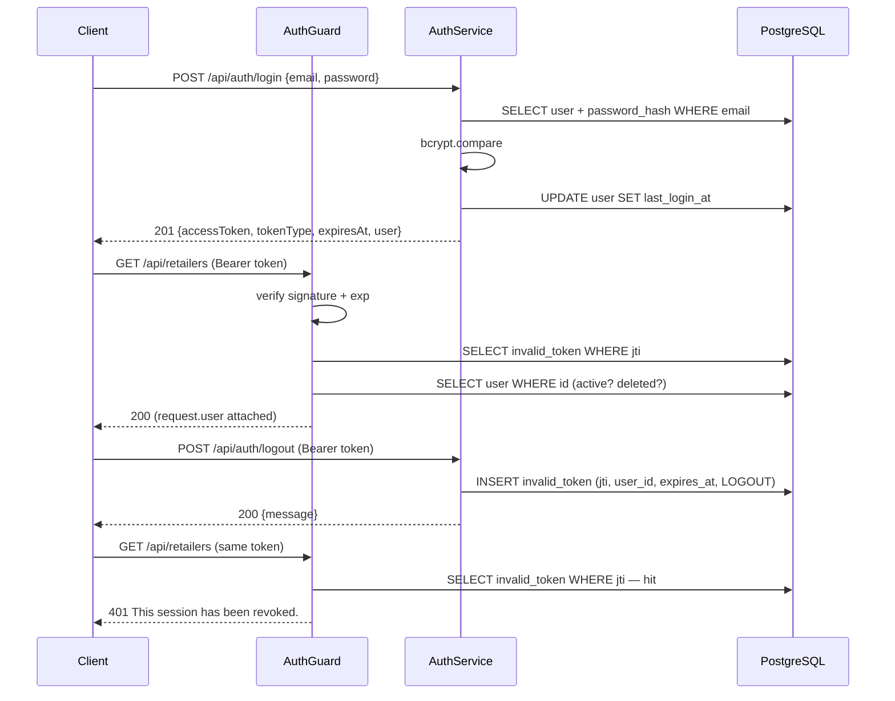

# Spira — Authentication

Reference for how callers authenticate against the Spira API. Current scope is the **three operations** that make up a session's life: signing in, signing out, and changing your own password.

| Endpoint | Purpose |
|---|---|
| `POST /api/auth/login` | Exchange email + password for an access token |
| `POST /api/auth/logout` | Revoke the token used for the request |
| `PATCH /api/auth/change-password` | Change your own password, revoking the current token |

> **Status:** draft. Refresh tokens, roles/permissions and account lockout are not implemented.

---

## Design decisions

Three choices shape everything below. Each had a cheaper alternative that was rejected.

| Decision | Choice | Why |
|---|---|---|
| Token transport | **`Authorization: Bearer` only** | No cookies means no CSRF surface and no `cookie-parser`. The generated TypeScript client is usable from non-browser callers, and tokens are trivial to exercise in tests. |
| Revocation | **Real, via the `invalid_token` denylist** | A JWT stays cryptographically valid until it expires, so clearing a client-side token is not logout. Writing the token's `jti` to the denylist is what makes "sign out" actually end the session. |
| Authorization | **Authentication only, no roles yet** | The `user.role` enum exists but no endpoint needs it yet. Adding a `@Roles()` guard before there is a rule to encode would be guesswork. |

The denylist choice has a cost worth stating plainly: **every authenticated request performs a database read** against `invalid_token`, plus a second read to load the user. That is fine at current scale. If it becomes hot, the usual fix is to mirror the denylist in Redis with a TTL equal to the token's remaining lifetime, keeping the table as the source of truth.

---

## The access token

A stateless JWT, signed with `HS256` by `@nestjs/jwt`.

```ts
export interface JwtPayload {
  sub: string;   // the authenticated user's ID
  jti: string;   // unique token ID — this is what gets revoked
  iat?: number;
  exp?: number;
}
```

`jti` is a fresh UUID per sign-in, generated with `node:crypto`'s `randomUUID()`. It exists so a single token can be named and revoked. Nothing else is put in the payload: no role, no email, no permissions. A token is an identity claim, not a cache — anything else would go stale the moment the record changed.

Lifetime is `jwt.accessTokenExpiresIn`, currently **2 hours**. There is no refresh token, so after two hours the caller signs in again.

---

## Protecting routes

`AuthGuard` is registered **globally**, so every route is protected by default and routes opt out explicitly:

```ts
// app.module.ts
providers: [
  AppService,
  { provide: APP_GUARD, useClass: AuthGuard },
]
```

```ts
// common/decorators/public.decorator.ts
export const IS_PUBLIC_KEY = 'isPublic';
export const Public = () => SetMetadata(IS_PUBLIC_KEY, true);
```

The guard reads that metadata off the handler or its class and returns early:

```ts
const isPublic = this.reflector.getAllAndOverride<boolean>(IS_PUBLIC_KEY, [
  context.getHandler(),
  context.getClass(),
]);
if (isPublic) return true;
```

Protect-by-default is the point. Forgetting `@UseGuards` on a new controller would silently expose it; forgetting `@Public()` merely makes a route return `401` until someone notices.

Exactly **two** routes are public today:

| Route | Why |
|---|---|
| `GET /api` | Liveness check on `AppController`. Must answer before anyone holds a token. |
| `POST /api/auth/login` | Cannot require the token it issues. |

> Note: `main.ts` mounts Swagger UI at the same `/api` path (`SwaggerModule.setup(globalPrefix, …)`), so the two overlap and the UI is what a browser gets. Worth separating — e.g. Swagger at `/api/docs`, or a dedicated `GET /api/health` — if the liveness route is meant to be reachable.

### Swagger

`@ApiBearerAuth()` belongs on protected controllers and methods, never on a `@Public()` route — otherwise the OpenAPI document advertises authentication the endpoint does not require, and the generated client sends a header for nothing. Login is annotated with neither.

---

## What `AuthGuard` checks

In order. Any failure is a `401`, never a `403` — the caller is unauthenticated, not forbidden.

1. Is the route `@Public()`? If so, stop here.
2. Is there an `Authorization: Bearer <token>` header? → `Authentication token is missing.`
3. Does the token verify against `jwt.secret` and is it unexpired? → `Invalid or expired token.`
4. Does it carry `sub`, `jti` and `exp`? → `Invalid or expired token.`
5. Is its `jti` **absent** from `invalid_token`? → `This session has been revoked.`
6. Does its user still exist and is it not soft-deleted? → `Invalid or expired token.`
7. Is that user `isActive`? → `This account is not active.`

Steps 6 and 7 are what make deactivating or deleting an account take effect **immediately** rather than whenever the token happens to expire. They are the second database read, and they are deliberate.

On success the guard attaches the caller:

```ts
export interface AuthenticatedUser {
  id: string;         // the token's `sub`
  jti: string;        // needed to revoke this token
  expiresAt: Date;    // from `exp`, copied into the denylist row on revocation
}

export interface RequestWithUser extends Request {
  user: AuthenticatedUser;
}
```

Controllers reach it with `@Req() req: RequestWithUser` and pass `req.user` to the service. `jti` and `expiresAt` are on the request because revoking a token requires both — the denylist row needs the ID to match on and the expiry so the purge job can clean it up.

---

## Session flow



---

## Endpoints

### `POST /api/auth/login`

`@Public()`. Returns **201**.

```json
{ "email": "boss@real.com.py", "password": "Str0ng-P4ssw0rd" }
```

```json
{
  "accessToken": "eyJhbGciOiJIUzI1NiIsInR5cCI6IkpXVCJ9...",
  "tokenType": "Bearer",
  "expiresAt": "2026-09-17T12:32:05.000Z",
  "user": { "id": "...", "email": "boss@real.com.py", "role": "RETAILER", "...": "..." },
  "message": "Signed in successfully."
}
```

The email is trimmed and lowercased before lookup, and the column is `citext`, so casing never matters.

Three different failures — unknown email, wrong password, inactive account — all return the **same** `401 Invalid credentials.` This is deliberate: distinguishing them turns the endpoint into an oracle for which email addresses have accounts.

`password_hash` is `select: false` on the entity, so login uses a dedicated `findOneByEmailWithPassword` that adds it back explicitly. Every other read leaves the hash on the server.

### `POST /api/auth/logout`

Authenticated. Returns **200** — note `@HttpCode(HttpStatus.OK)`, because Nest answers `201` for `@Post` by default.

Inserts `{ jti, userId, expiresAt, reason: LOGOUT }` into `invalid_token`. The row copies the token's own expiry so the purge job (`DELETE FROM invalid_token WHERE expires_at < now()`) can drop it once it is dead weight.

Revoking an already-revoked token is harmless, but in practice the guard rejects the request first, so a second logout with the same token returns `401`.

### `PATCH /api/auth/change-password`

Authenticated. Returns **200**.

```json
{ "oldPassword": "Str0ng-P4ssw0rd", "newPassword": "Even-Str0nger-P4ss" }
```

In order: verify `oldPassword` with bcrypt (`401` if wrong), reject a `newPassword` equal to the current one (`401`), re-hash, then revoke the current token with reason `PASSWORD_CHANGE`.

That last step matters. Changing a password is often a response to suspected compromise, so leaving the session that performed it valid would undercut the point. The caller signs in again with the new password.

---

## Password rules

Enforced by `class-validator` on the DTOs, so violations are `400` with per-rule messages before any handler runs.

| Rule | Value |
|---|---|
| Minimum length | 12 characters |
| Maximum length | 72 characters |
| Composition | at least one lowercase letter, one uppercase letter and one digit |
| Hash | bcrypt, cost factor 10 |

The 72-character ceiling is not arbitrary: **bcrypt silently truncates input beyond 72 bytes**, so accepting longer passwords would quietly ignore the tail and mislead anyone who set one.

No password history, no expiry, no reuse check across changes beyond "must differ from the current one".

---

## Configuration

| Variable | Default | Used for |
|---|---|---|
| `ACCESS_TOKEN_SECRET` | `secret` | Signs and verifies access tokens (`jwt.secret`) |

Read through `src/config/jwt.config.ts`, which also declares `refreshSecret`, `accessTokenExpiresIn` (`'2h'`) and `refreshTokenExpiresIn`.

> ⚠️ `accessTokenExpiresIn` is **hard-coded in `jwt.config.ts`**, not read from the environment. `TOKEN_EXPIRATION_HOURS` in `.env.example` is a leftover and has no effect. `REFRESH_TOKEN_SECRET` and `refreshTokenExpiresIn` are likewise unused until refresh tokens exist, and `SECURE_COOKIE` is a leftover from a cookie-based approach that was not adopted.

Change the default `ACCESS_TOKEN_SECRET` before any deployment. With the default in place, anyone can forge a token for any user ID.

---

## Bootstrapping the first user

**There is currently no way to create the first account through the API.** `POST /api/users` requires a token, and obtaining a token requires an existing user.

Until a seeding path exists, insert the first user directly, hashing the password with bcrypt at cost 10:

```sql
INSERT INTO "user" (email, password_hash, role)
VALUES ('admin@spira.app', '$2b$10$...', 'ADMIN');
```

Options worth choosing between before this ships:

| Option | Trade-off |
|---|---|
| `pnpm seed:admin` script reading credentials from `.env` | Explicit and repeatable; one more script to maintain |
| First-run bootstrap that only works while `user` is empty | No manual step; a code path that must never misfire |
| Public self-signup limited to `RETAILER`/`RECIPIENT`, `ADMIN` seeded separately | Needed eventually anyway; requires email verification to be useful |

---

## Differences from the reference project

`MandiocaAPI` supplied the decorator-and-global-guard pattern, but three things were changed on purpose.

| Area | MandiocaAPI | Spira |
|---|---|---|
| Denylist | Has an `invalid_token` table that **the guard never reads**. Logout deletes the refresh-token row and clears cookies, so the access token keeps working until it expires. | The guard checks the denylist, so logout genuinely ends the session. |
| Account state | Not checked per request. A deactivated user keeps working until their token expires. | Checked per request; deactivation and soft delete apply immediately. |
| Caller on the request | `request.userId: number` | `request.user: AuthenticatedUser` — the `jti` and `expiresAt` are required for revocation. |
| Authorization | `@RequirePermission(...)` against permission/role tables plus a cache service. | Not ported. Spira has a `UserRole` enum, not permission tables. |
| Transport | Cookie first, `Bearer` fallback. | `Bearer` only. |

---

## Not implemented yet

Deliberately out of scope for this pass:

| Concern | Why deferred |
|---|---|
| Refresh tokens | Access-token revocation works without them; needs a `refresh_token` table and a rotation design |
| Roles / permissions | No endpoint has a rule to encode yet; `@Roles()` plus a `RolesGuard` is the natural shape |
| Email verification | `user.email_verified_at` exists but nothing sets it; login does not require it |
| Password reset | Needs a token table and working mail; the `SMTP_*` variables are placeholders |
| Lockout / throttling | Depends on `failed_login_attempts` and `locked_at` columns the `user` table deliberately omits |
| MFA | Same — no columns, no flow |
| Denylist purge scheduling | `DELETE /api/invalid-tokens/expired` exists but nothing calls it on a schedule |
