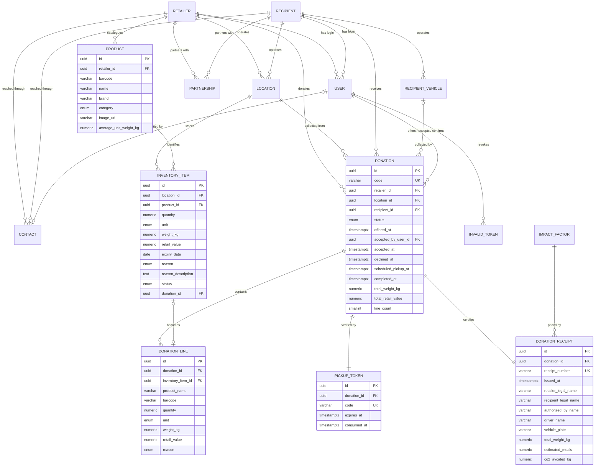

# Spira — Database Schema v2 (aligned to the donation portal)

Reworks [`database-schema.md`](./database-schema.md) against the actual product, as built in the `spira-donation-portal` demo. The v1 schema was designed before there was a UI; it modelled **who the parties are** and guessed at **how they would be matched**. The portal shows that the product is something narrower and more concrete: a store manager logs surplus stock, queues it, and hands it to an NGO driver against a QR code and a tax certificate.

> **Status:** proposal, decisions taken. Nothing is migrated yet. Authentication is carried over unchanged — see [`authentication.md`](./authentication.md), and the [Decisions](#decisions) section records the seven calls that shaped this document.

| Change | Count |
|---|---|
| Tables kept as-is | 2 (`user`, `invalid_token`) |
| Tables kept, reshaped | 4 (`retailer`, `recipient`, `location`, `contact`) |
| Tables added | 9 |
| Columns removed | 27 |
| Enums replaced or added | 6 |

**The recipient gets its own app.** NGOs will log in and act on donations, so this schema models a two-sided flow: the retailer offers, the recipient accepts or declines, and only then is there a pickup. That is the one decision that changed the design rather than merely confirming it — see [Decisions](#decisions).

---

## What the portal actually is

Established from `index.html`, `metadata.json` and `AppHeader.tsx`:

> *"Spira mobile donation portal for **supermarket managers** to divert surplus and near-expiry food directly to local charities and food banks."*

Four tabs — Home, Inventory, Donations, Profile — and a hardcoded `Store` role pill. **This is the retailer's app.** The NGO exists only as a directory row the retailer picks from, plus a simulated "NGO Driver Screen" (`NgoPreviewModal`) reachable from the retailer's own Profile under *"Simulation & Testing Tools"*. The NGO never writes anything.

Three consequences for the schema:

1. **The recipient side is a participant, but not a matching engine.** In the portal it is a bare directory — an NGO is assigned with `item.assignedNGO || mockNGOs[0]`, with no chooser, no offer, no acceptance and no refusal. The recipient app that is coming changes that: recipients log in and accept or decline, which is why `donation` carries a two-sided lifecycle below. What it does **not** bring back is automatic matching, so v1's capability columns — service radius, transport capacity, accepted categories, dietary restrictions, background checks — still have no reader and are still removed.
2. **The donation is the missing entity.** v1 explicitly deferred it (*"Donation lots and matching are not modeled yet"*). It is now the centre of the product.
3. **Inventory is the missing entity.** v1 has no notion of stock at all.

---

## The v1 problems this fixes

Six defects found in the portal that are really schema defects. They drive most of the design below.

| # | Defect in the portal | Schema consequence |
|---|---|---|
| 1 | Handover **hard-deletes** the rows: `setItems(prev => prev.filter(i => !itemIds.includes(i.id)))`. The declared `status: 'completed'` is never assigned by any code path. | Items must be *transitioned*, never deleted. Donated history has to survive in its own tables. |
| 2 | A pending donation is not a record — it is `items.filter(i => i.status === 'ready_for_donation')`. One implicit global batch, no id, no owner, no scheduled time. `Batch #FR-402` is a hardcoded string in JSX. | A real `donation` row with an identity and a lifecycle. |
| 3 | The receipt claims to be a legal certificate (*"Issued under Food Recovery & Good Samaritan Acts"*, *"Tax Exemption & Compliance Certificate"*) yet recomputes its totals at render and reads the donating party from **live mutable state**. Editing the branch would retroactively rewrite historical certificates. | An immutable `donation_receipt` with the parties and totals frozen at issue. |
| 4 | `MarketBranch.stats` are additive counters with no provenance. They have **already drifted**: `totalDeliveriesCount: 42` while `completedDeliveries.length` is `1`, and `handleResetData` clears the history but restores the counter to 42. | Impact is derived from donations, not accumulated. |
| 5 | The QR token is a **static, per-NGO constant** (`pickupCode: 'CH-NYC-882'`), reused for every pickup, and validation accepts any string of 4+ characters without ever comparing it to the expected NGO. The receipt nonetheless asserts a *"cryptographic QR handover token"*. | A per-donation, single-use, expiring token. |
| 6 | `daysRemaining` is a stored integer that duplicates `expiryDate`, is hardcoded to `1` on create, and is never recomputed. Seed row `item-103` is already wrong (`expiryDate: '2026-09-16'`, `daysRemaining: 0`, when "today" is the 17th). | Derive from `expiry_date`; do not store. |

---

## ER diagram

Key columns only. `user` and `invalid_token` are unchanged from v1.



---

## Conventions

Unchanged from v1 and still right: `snake_case` in Postgres and `camelCase` in TypeScript mapped explicitly; singular table names; `uuid` primary keys via `gen_random_uuid()`; `created_at` / `updated_at` / `deleted_at` on every table except `invalid_token`; every unique index partial on `WHERE deleted_at IS NULL`; `timestamptz` never `timestamp`; `numeric` never `float` for weights and money; `citext` for emails.

Two additions the portal forces:

**Money needs a currency.** The portal hardcodes `$` and names a field `totalValueSavedUsd`. Every monetary column here is `numeric(10,2)` paired with a `currency char(3)` (ISO 4217) on its owning row, defaulting to `'USD'`.

**Display strings are not timestamps.** The portal stores `addedToDonationAt` as `'10:15 AM'`, `'Just now'`, and a Turkish-locale `'14:48'` — three formats for one field — and `delivery.date` as `'Sep 16, 2026 • 02:48 PM'`. None are sortable or queryable. Every one becomes `timestamptz`, formatted in the UI.

---

## Tables carried over unchanged

### `user` and `invalid_token`

**No changes.** The portal has no login at all — a grep for `login|auth|session|password|currentUser|token` across it returns only cosmetic prose, and "my organization" is a hardcoded `mockBranch` constant. So the portal offers no evidence for or against the auth design, and the working implementation in [`authentication.md`](./authentication.md) stays exactly as it is: Bearer access tokens, `jti` on the `invalid_token` denylist, `@Public()` opt-out, no roles yet.

Two relationships do change around it, without touching either table.

The receipt line `Authorized: {branch.managerName}` is the person who confirmed the handover, which becomes `donation.confirmed_by_user_id → user(id)`. That is how `MarketBranch.managerName` stops being a string on the organization.

And because recipients are getting their own app, **`user.recipient_id` and `UserRole.RECIPIENT` go from speculative to load-bearing.** Both already exist and work; the `chk_user_role_profile` constraint already guarantees a `RECIPIENT` user is linked to exactly one recipient and no retailer. Nothing needs adding — a recipient login is simply a `user` row with `role = 'RECIPIENT'`. The only new requirement is authorization: a recipient-side user must not be able to read another organization's donations, which is a guard concern rather than a schema one, and is the point at which the deferred `@Roles()` decorator stops being optional.

---

## Tables reshaped

### `retailer` — the chain

`MarketBranch.chain` (`'Whole Foods Market'`) is the legal entity; everything else on `MarketBranch` is branch-level. v1 already split these correctly, which is the one structural thing the portal validates rather than contradicts.

**Removed — no UI, no writer, no reader anywhere in the portal:**

| Column | Why it goes |
|---|---|
| `slug` | No public profile URLs exist. Identity is `tax_id` and the new `location.code`. |
| `food_categories` | Was for matching. No matching exists. Categories now live per `product`. |
| `donation_frequency` | Never displayed or set. |
| `requires_recipient_transport` | The NGO always collects; there is no delivery mode anywhere. |
| `min_pickup_notice_hours` | No scheduling UI. |
| `handling_instructions` | Per-item `reason_description` carries the practical notes instead. |

**Kept:** `legal_name`, `trade_name`, `tax_id`, `business_type`, `description`, `website`, `logo_url`, `status`, `verified_at`, `verified_by`, `food_safety_license_number`, `food_safety_license_expires_at`, `terms_accepted_at`, `terms_version`.

`tax_id` earns its place here: the certificate is a tax document and needs the donor's registration number, which the portal's receipt is currently missing.

### `location` — the branch

| Column | Change | Source |
|---|---|---|
| `code` | **new**, `varchar(40)`, unique per retailer | `branchCode: 'WF-NYC-402'`, shown as `Supermarket Branch • {branch.branchCode}` |
| `opening_hours` | **new**, `jsonb` | `operatingHours: '08:00 AM - 10:00 PM'` — a single free-text range with no day-of-week dimension. Model it per weekday from the start; a store's Sunday hours differ. |
| `label` | kept | `branchName: 'Downtown Waterfront Branch'` |
| `pickup_windows` | kept, semantics clarified | Distinct from `opening_hours`: when collections may happen, not when the store is open. |
| `has_cold_storage`, `has_freezer` | **keep, unused for now** | No UI, but cold chain appears as prose in `reason_description` (*"Kept in unbroken cold chain storage"*) and will matter once chilled goods are matched. |
| `storage_capacity_kg` | **remove** | No reader, and capacity is an NGO-side concern. |
| `city` | kept | Note the portal stores it *both* as a column and inside a single-line `address`, and never renders the column. Keep structured components; drop the single-line form. |

### `recipient` — the NGO

The largest shrink in the proposal. `NGOInfo` is ten string fields, and it fuses four entities: the organization, its driver, its vehicle, and a pickup appointment. Split them.

| `NGOInfo` field | Goes to |
|---|---|
| `name` | `recipient.legal_name` |
| `shortName` | `recipient.short_name` — **new**; the UI uses it wherever space is tight (`'City Harvest'`) |
| `badge` | `recipient.type`. The three observed values map cleanly onto the existing enum: `'Certified Food Bank'` → `FOOD_BANK`, `'Hot Meals Program'` → `SOUP_KITCHEN`, `'Evening Shelter Support'` → `SHELTER`. It is a display label for a type, not a separate field. |
| `contactPerson`, `phone` | `contact` — and it must be split: `'Sarah Jenkins (Driver & Logistics)'` is a name and a role crammed into one string, so `full_name` + `job_title`. One of the three is a *Route Coordinator*, not a driver, so the role is real data. |
| `vehiclePlate` | `recipient_vehicle` (new) |
| `address` | `location` |
| `eta` | **nowhere.** Free text of three incompatible shapes: `'02:45 PM (18 min away)'`, `'04:00 PM (Scheduled)'`, `'Tomorrow 09:30 AM'`. Becomes `donation.scheduled_pickup_at`; the "18 min away" part is a live calculation, not a column. |
| `pickupCode` | `pickup_token` (new), per donation rather than per NGO |
| `id` | `recipient.id` |

**Removed — 17 columns, none of which the portal reads or writes:**

`service_radius_km`, `has_vehicle`, `transport_capacity_kg`, `has_refrigerated_transport`, `people_served_per_week`, `max_daily_intake_kg`, `accepted_food_categories`, `excluded_food_categories`, `dietary_restrictions`, `accepts_near_expiry`, `accepts_prepared_food`, `accepts_frozen`, `background_check_status`, `national_id`, `nonprofit_registration_number`, `insurance_policy_number`, `slug`.

Two things worth saying plainly about that list. It is not dead weight because it was badly designed — it was designed for a matching engine, and **the portal contains no matching**. If matching is still on the roadmap, most of these come back; the recommendation is to remove them now and reintroduce them with the feature, rather than carry a dozen never-populated columns through every migration. The exceptions I would keep regardless are `food_handling_certification_number` and `certification_expires_at`, since food-safety paperwork is a compliance fact independent of matching, and `tax_id`, which the certificate needs.

`CERTIFIED_INDIVIDUAL` also loses its reason to exist: the portal's recipients are all organizations, and `national_id` was the only column serving individuals.

### `contact`

`ContactType` gains **`DRIVER`**, the role the portal needs and the one the certificate prints.

One column is added: **`user_id`** (`uuid`, nullable, FK → `user(id)` `SET NULL`, unique where set).

This is a direct consequence of recipients logging in. `user` is deliberately credentials-only — v1 states plainly that *"names and phone numbers live in `contact`"* — but the certificate has to print a `driver_name`. Rather than give `user` a name and break that rule, a contact can point at the login that belongs to it. So the driver who accepts a donation in the NGO app is a `user`, their name for the certificate comes from the linked `contact`, and `user` stays a pure identity record.

---

## New tables

### `product` — the catalogue

Every inventory row in the portal repeats `barcode`, `name`, `brand`, `category` and `imageUrl`, and the inventory search matches on `barcode`. That is a catalogue keyed by barcode.

| Column | Type | Null | Notes |
|---|---|---|---|
| `id` | `uuid` | NO | PK |
| `retailer_id` | `uuid` | NO | FK → `retailer(id)` `CASCADE`. Scoped per retailer, not global: private-label items differ by chain. |
| `barcode` | `varchar(14)` | YES | EAN-13/GTIN-14. Unique per retailer when present, `NULL` for unbarcoded goods (loose produce). |
| `name` | `varchar(200)` | NO | `'Organic Whole Milk 1 Gal (4-Pack)'` |
| `brand` | `varchar(120)` | YES | `'Horizon Organic'`. The portal also abuses this for departments (`'In-Store Bakery'`), which is what `default_department` is for. |
| `default_department` | `varchar(120)` | YES | Separates "Fresh Produce" (a department) from "Horizon Organic" (a brand). |
| `category` | `enum` | NO | `product_category`, below |
| `image_url` | `varchar(500)` | YES | Portal uses external Unsplash URLs. Real uploads want an attachment table later. |
| `default_unit` | `enum` | YES | `unit_of_measure` |
| `average_unit_weight_kg` | `numeric(8,3)` | YES | Replaces the hardcoded `quantity * 0.8` fallback in `AddProductModal`. |

> Adopting a catalogue is the one genuinely optional call here. The cheaper alternative is to denormalize these five fields onto `inventory_item`, matching the portal exactly. I recommend the catalogue because barcode search, per-product average weight, and repeat logging of the same SKU all want it — but it does add a lookup-or-create step to the "log an item" endpoint.

### `inventory_item` — a lot of stock flagged for donation

Not general stock control. One row is a quantity of one product, at one branch, with one reason for being donatable.

| Column | Type | Null | Notes |
|---|---|---|---|
| `id` | `uuid` | NO | PK |
| `location_id` | `uuid` | NO | FK → `location(id)` `CASCADE`. **The portal has no branch reference on an item at all** — it assumes one store. This is the single most important FK to add. |
| `product_id` | `uuid` | NO | FK → `product(id)` `RESTRICT` |
| `quantity` | `numeric(10,3)` | NO | `> 0` |
| `unit` | `enum` | NO | `unit_of_measure` |
| `weight_kg` | `numeric(10,3)` | NO | Stored, not derived. Mock data does not obey any conversion factor (2 crates → 10.0 kg), so it is authored. |
| `retail_value` | `numeric(10,2)` | YES | Retail value of **this whole quantity**, not per unit — see decision 1. |
| `currency` | `char(3)` | NO | Default `'USD'` |
| `expiry_date` | `date` | YES | `NULL` for non-perishables |
| `reason` | `enum` | NO | `donation_reason` |
| `reason_description` | `text` | YES | Free text; carries the cold-chain and packaging notes that reach the certificate |
| `status` | `enum` | NO | `inventory_item_status`, default `IN_INVENTORY` |
| `donation_id` | `uuid` | YES | FK → `donation(id)` `SET NULL`. Set while reserved, and retained after delivery for provenance. |
| `listed_at` | `timestamptz` | NO | When it was logged. Default `now()`. |
| `queued_at` | `timestamptz` | YES | Replaces `addedToDonationAt`, as a real timestamp. |

**`days_remaining` is deliberately absent.** Derive it: `expiry_date - CURRENT_DATE`. The portal's "expiring soon" rule is `daysRemaining <= 1`; as a query that is `expiry_date <= CURRENT_DATE + 1`. The threshold itself belongs in configuration, not in a `.filter()`.

```sql
CONSTRAINT chk_inventory_quantity CHECK (quantity > 0)
CONSTRAINT chk_inventory_weight   CHECK (weight_kg >= 0)
-- A reserved or donated item must name its donation; an available one must not.
CONSTRAINT chk_inventory_donation CHECK (
     (status IN ('RESERVED','DONATED') AND donation_id IS NOT NULL)
  OR (status IN ('IN_INVENTORY','WITHDRAWN','EXPIRED') AND donation_id IS NULL)
)
```

### `donation` — the core transaction

The entity v1 deferred and the portal never created. `types.ts` sketches it as `DonationBatch`, unused; this is that shape, corrected.

| Column | Type | Null | Notes |
|---|---|---|---|
| `id` | `uuid` | NO | PK |
| `code` | `varchar(30)` | NO | Unique, user-facing. The portal's `Batch #FR-402` is a hardcoded literal; make it real and sequential. |
| `retailer_id` | `uuid` | NO | FK → `retailer(id)` |
| `location_id` | `uuid` | NO | FK → `location(id)`. Which branch it leaves from. |
| `recipient_id` | `uuid` | NO | FK → `recipient(id)` `RESTRICT` — never delete an NGO out from under a donation record. |
| `recipient_vehicle_id` | `uuid` | YES | FK → `recipient_vehicle(id)` `SET NULL`. Chosen by the recipient when accepting. |
| `driver_contact_id` | `uuid` | YES | FK → `contact(id)` `SET NULL`. Who is collecting; supplies `driver_name` on the certificate. |
| `status` | `enum` | NO | `donation_status`, default `DRAFT` |
| `created_by_user_id` | `uuid` | YES | FK → `user(id)` `SET NULL`. A retailer-side user. |
| `offered_at` | `timestamptz` | YES | When the retailer sent it to the recipient |
| `accepted_by_user_id` | `uuid` | YES | FK → `user(id)` `SET NULL`. A **recipient-side** user. |
| `accepted_at` | `timestamptz` | YES | |
| `declined_at` | `timestamptz` | YES | |
| `decline_reason` | `text` | YES | Why the recipient said no. The retailer needs this to re-offer elsewhere. |
| `confirmed_by_user_id` | `uuid` | YES | FK → `user(id)` `SET NULL`. The retailer-side user who scanned the QR — the certificate's `Authorized:` line. |
| `scheduled_pickup_at` | `timestamptz` | YES | Replaces the free-text `eta`. Proposed by the retailer, confirmed or amended on accept. |
| `completed_at` | `timestamptz` | YES | Set once, at handover |
| `cancelled_at` | `timestamptz` | YES | |
| `cancellation_reason` | `text` | YES | Covers the no-show — see decision 4. |
| `line_count` | `smallint` | NO | Default `0` |
| `total_weight_kg` | `numeric(12,3)` | NO | Default `0` |
| `total_retail_value` | `numeric(12,2)` | NO | Default `0` |
| `currency` | `char(3)` | NO | Default `'USD'` |

The three totals are **stored, not derived** — the same call the unused `DonationBatch` made with `totalWeightKg` and `estimatedMeals`. They are recomputed from `donation_line` on every mutation while the donation is open, and frozen once `status = 'DELIVERED'`. A delivered donation's totals must never move, because a certificate has been issued against them.

```sql
CONSTRAINT chk_donation_completed CHECK (
  (status = 'DELIVERED') = (completed_at IS NOT NULL)
)
CONSTRAINT chk_donation_accepted CHECK (
  (accepted_at IS NULL) = (accepted_by_user_id IS NULL)
)
-- A donation cannot be both accepted and declined.
CONSTRAINT chk_donation_decision CHECK (
  NOT (accepted_at IS NOT NULL AND declined_at IS NOT NULL)
)
```

### The two-sided lifecycle

Because the recipient now has an app, a donation is a negotiation rather than an announcement:

```
DRAFT ──▶ OFFERED ──▶ ACCEPTED ──▶ READY_FOR_PICKUP ──▶ DRIVER_EN_ROUTE ──▶ DELIVERED
            │                                                    │
            └──▶ DECLINED ──▶ (re-offer: back to OFFERED)         └──▶ CANCELLED
```

Who may move it:

| Transition | Actor |
|---|---|
| `DRAFT → OFFERED` | Retailer — picks the partner and sends it |
| `OFFERED → ACCEPTED` / `DECLINED` | **Recipient** |
| `DECLINED → OFFERED` | Retailer, having chosen a different partner |
| `ACCEPTED → READY_FOR_PICKUP` | Retailer, once the goods are physically staged |
| `READY_FOR_PICKUP → DRIVER_EN_ROUTE` | **Recipient**, when the driver sets off. This is the state the portal declares and never reaches. |
| `→ DELIVERED` | Retailer, by scanning the recipient's QR token |
| `→ CANCELLED` | Either side, with a reason |

The portal has none of this — it goes straight to a queue and then to a handover. `DECLINED` is the state that matters most in practice: today a manager cannot find out that an NGO does not want 12 loaves of sourdough.

### `donation_line` — an immutable snapshot of what left the store

| Column | Type | Null | Notes |
|---|---|---|---|
| `id` | `uuid` | NO | PK |
| `donation_id` | `uuid` | NO | FK → `donation(id)` `CASCADE` |
| `inventory_item_id` | `uuid` | YES | FK → `inventory_item(id)` `SET NULL` — provenance, not the source of truth |
| `product_name` | `varchar(200)` | NO | Snapshot |
| `brand` | `varchar(120)` | YES | Snapshot |
| `barcode` | `varchar(14)` | YES | Snapshot |
| `category` | `enum` | NO | Snapshot |
| `quantity` | `numeric(10,3)` | NO | |
| `unit` | `enum` | NO | |
| `weight_kg` | `numeric(10,3)` | NO | |
| `retail_value` | `numeric(10,2)` | YES | Extended line value |
| `reason` | `enum` | NO | |
| `reason_description` | `text` | YES | Printed on the certificate |

The snapshot columns are the point. `ReceiptModal` reads live item objects, so renaming a product would rewrite history. The portal gets away with it only because it deep-copies items into `localStorage` — an FK alone would dangle, since the source rows are deleted.

### `donation_receipt` — the certificate

The portal's receipt is framed as a legal document: a certificate number, *"Issued under Food Recovery & Good Samaritan Acts"*, a `Tax Exemption & Compliance Certificate` subtitle, an `Approved` status chip, Print and Download actions, and re-openable from history. It must be reproducible byte-for-byte years later. Everything it prints is therefore frozen here, including both parties' names.

| Column | Type | Null | Notes |
|---|---|---|---|
| `id` | `uuid` | NO | PK |
| `donation_id` | `uuid` | NO | FK → `donation(id)` `RESTRICT`, **unique** — one certificate per donation |
| `receipt_number` | `varchar(30)` | NO | Unique. The portal mints `FR-REC-${random 6 digits}`, which collides and does not match its own seed data (`FR-REC-29104`, 5 digits). Use a per-year sequence. |
| `issued_at` | `timestamptz` | NO | The portal hardcodes `'Sep 16, 2026 • 14:48'` and ignores the delivery's own date. |
| `retailer_legal_name` | `varchar(200)` | NO | Snapshot |
| `retailer_tax_id` | `varchar(40)` | YES | Snapshot. Absent from the portal's receipt and required on a tax document. |
| `location_label` | `varchar(150)` | NO | Snapshot |
| `location_code` | `varchar(40)` | YES | Snapshot |
| `location_address` | `text` | NO | Snapshot, rendered flat |
| `authorized_by_name` | `varchar(150)` | NO | Snapshot of the confirming user |
| `recipient_legal_name` | `varchar(200)` | NO | Snapshot |
| `recipient_tax_id` | `varchar(40)` | YES | Snapshot |
| `driver_name` | `varchar(150)` | YES | Snapshot |
| `vehicle_plate` | `varchar(20)` | YES | Snapshot. The de-facto identity check at handover. |
| `line_count` | `smallint` | NO | |
| `total_weight_kg` | `numeric(12,3)` | NO | |
| `total_retail_value` | `numeric(12,2)` | YES | |
| `currency` | `char(3)` | NO | |
| `estimated_meals` | `integer` | YES | Frozen, not recomputed |
| `co2_avoided_kg` | `numeric(12,3)` | YES | Frozen, not recomputed |
| `impact_factor_id` | `uuid` | YES | FK → `impact_factor(id)`, so the factors used are auditable |
| `legal_reference` | `varchar(200)` | YES | `'Food Recovery & Good Samaritan Acts'` — jurisdiction-dependent, so data |
| `verification_code` | `varchar(60)` | YES | The consumed `pickup_token.code`, as evidence |

`deleted_at` is **omitted** here, as on `invalid_token`, and for the same class of reason: a tax certificate that can be silently filtered out of a query is worse than one that cannot be removed. Void it with a status if you must, but never hide it.

### `pickup_token` — the QR handover credential

Replaces `NGOInfo.pickupCode`, which is one static string per NGO reused for every pickup forever.

| Column | Type | Null | Notes |
|---|---|---|---|
| `id` | `uuid` | NO | PK |
| `donation_id` | `uuid` | NO | FK → `donation(id)` `CASCADE` |
| `code` | `varchar(60)` | NO | Unique. What the QR encodes. |
| `issued_at` | `timestamptz` | NO | Default `now()` |
| `expires_at` | `timestamptz` | NO | |
| `consumed_at` | `timestamptz` | YES | `NULL` = still usable |
| `consumed_by_user_id` | `uuid` | YES | FK → `user(id)` `SET NULL` — which manager scanned it |

Bound to one donation, single-use, and expiring. This is what lets the certificate's *"authenticated with a cryptographic QR handover token"* claim actually be true; today the check is `code.length >= 4`.

> This could collapse into four columns on `donation`. It is a table because re-issuing a token after a failed pickup is likely, and that wants rows.

### `recipient_vehicle`

| Column | Type | Null | Notes |
|---|---|---|---|
| `id` | `uuid` | NO | PK |
| `recipient_id` | `uuid` | NO | FK → `recipient(id)` `CASCADE` |
| `plate` | `varchar(20)` | NO | `'NYC-882-FD'` |
| `description` | `varchar(120)` | YES | |
| `is_refrigerated` | `boolean` | NO | Default `false`. Absorbs v1's `recipient.has_refrigerated_transport` at the right grain — a fleet is mixed. |
| `capacity_kg` | `numeric(10,2)` | YES | Likewise absorbs `transport_capacity_kg`. |
| `is_active` | `boolean` | NO | Default `true` |

### `retailer_recipient_partnership`

The Profile tab renders *"Partner NGOs & Soup Kitchens — 3 Organizations"*, but `ProfileTab.tsx` imports `mockNGOs` directly. The partner list is not connected to the branch at all. This connects it.

| Column | Type | Null | Notes |
|---|---|---|---|
| `id` | `uuid` | NO | PK |
| `retailer_id` | `uuid` | NO | FK → `retailer(id)` `CASCADE` |
| `recipient_id` | `uuid` | NO | FK → `recipient(id)` `CASCADE` |
| `status` | `enum` | NO | `partnership_status` |
| `is_preferred` | `boolean` | NO | Default `false`. Gives `mockNGOs[0]` a real meaning. |
| `started_at` | `timestamptz` | YES | |

Unique on `(retailer_id, recipient_id) WHERE deleted_at IS NULL`.

### `impact_factor`

The portal's impact numbers are magic constants: `2.5` meals per kg, duplicated across five files, and `2` kg CO₂ per kg, in one. They belong in data so receipts can pin the version that produced them and so the values can be revised without rewriting history.

| Column | Type | Null | Notes |
|---|---|---|---|
| `id` | `uuid` | NO | PK |
| `label` | `varchar(60)` | NO | e.g. `'default-2026'` |
| `meals_per_kg` | `numeric(6,3)` | NO | `2.500` |
| `co2_kg_per_kg` | `numeric(6,3)` | NO | `2.000` |
| `effective_from` | `date` | NO | |
| `effective_to` | `date` | YES | `NULL` = current |

---

## Impact statistics: derive, do not accumulate

v1 had no stats. The portal has five counters on `MarketBranch.stats`, incremented at handover, and they have **already drifted from the history they claim to summarize** — `totalDeliveriesCount: 42` against one actual delivery, and a reset that clears the history while restoring the counter.

Every one of them is a pure function of delivered donations:

```sql
CREATE VIEW retailer_impact AS
SELECT d.retailer_id,
       COUNT(*)                                          AS delivery_count,
       SUM(d.total_weight_kg)                            AS rescued_kg,
       SUM(d.total_retail_value)                         AS retail_value_saved,
       SUM(r.estimated_meals)                            AS meals_provided,
       SUM(r.co2_avoided_kg)                             AS co2_avoided_kg
FROM donation d
JOIN donation_receipt r ON r.donation_id = d.id
WHERE d.status = 'DELIVERED' AND d.deleted_at IS NULL
GROUP BY d.retailer_id;
```

Meals and CO₂ come from the receipt rather than being recomputed, so a later change to `impact_factor` cannot retroactively alter what a certificate already stated. Group by `location_id` for the per-branch figures, and add a `date_trunc('year', completed_at)` key to make the `2026 Annual Report` label — currently a hardcoded string — mean something. If this gets slow, make it a materialized view; do not go back to counters.

---

## Enums

### Replaced

**`food_category` → `product_category`.** Only four of seven members survive, and the name itself is wrong: `baby_care` (infant formula) is not food, so a platform handling it cannot call the column a food category.

| v1 `FoodCategory` | v2 `product_category` | Note |
|---|---|---|
| `PRODUCE` | `PRODUCE` | |
| `BAKERY` | `BAKERY` | |
| `DAIRY` | `DAIRY` | |
| `MEAT` | `MEAT` | |
| `DRY_GOODS` | `PANTRY` | Renamed to match the UI's *"Pantry & Grains"* |
| `PREPARED` | — | No UI. Reintroduce with prepared-food handling. |
| `FROZEN` | — | Frozen is a storage condition, not a category. Model it as a flag if needed. |
| — | `BEVERAGE` | **new** |
| — | `BABY_CARE` | **new** |

### Added

| Enum | Members |
|---|---|
| `unit_of_measure` | `UNIT`, `PACK`, `CRATE`, `BOX`, `KG` |
| `donation_reason` | `NEAR_EXPIRY`, `DAMAGED_PACKAGING`, `SURPLUS_STOCK`, `AESTHETIC_IMPERFECTION` |
| `inventory_item_status` | `IN_INVENTORY`, `RESERVED`, `DONATED`, `WITHDRAWN`, `EXPIRED` |
| `donation_status` | `DRAFT`, `OFFERED`, `ACCEPTED`, `DECLINED`, `READY_FOR_PICKUP`, `DRIVER_EN_ROUTE`, `DELIVERED`, `CANCELLED` |
| `partnership_status` | `PENDING`, `ACTIVE`, `PAUSED`, `ENDED` |

`unit_of_measure` resolves a genuine mess: the portal defines units in three places that disagree. The type union says `'items' | 'kg' | 'packs' | 'crates'`, the Add Product form offers `units / packs / kg / boxes`, and the seeded history writes `'units'` — a value outside the declared union, i.e. a live type error. Six distinct strings are observable in data. `items` and `units` collapse to `UNIT`.

`inventory_item_status` fixes defect #1: `DONATED` is a terminal state a row *reaches*, not a row that gets deleted. `EXPIRED` and `WITHDRAWN` cover the write-off path the portal has no concept of — an item with `daysRemaining: 0` stays donatable forever today.

`donation_status` takes the unused `DonationBatch` lifecycle (`ready_for_pickup`, `driver_en_route`, `delivered`) and adds five states a real two-sided flow needs: `DRAFT` while the manager is still adding items, `OFFERED` / `ACCEPTED` / `DECLINED` for the recipient's answer, and `CANCELLED` for a no-show. Note `DRIVER_EN_ROUTE` is unreachable in the portal — nothing sets it — and the *"Ready for Pickup"* badge is hardcoded JSX; both become real once the recipient app can move the donation.

### Removed

`dietary_restriction` and `background_check_status` go with the recipient columns that used them. `donation_frequency` goes with `retailer.donation_frequency`.

### Kept

`profile_status`, `recipient_type`, `business_type`, `location_type`, `contact_type` (+ `DRIVER`), `user_role`, `invalid_token_reason`.

---

## Indexes

Driven by what the portal's UI actually queries:

```sql
-- Inventory list: always scoped to one branch and one status
CREATE INDEX idx_inventory_location_status ON inventory_item (location_id, status)
  WHERE deleted_at IS NULL;

-- "Expiring soon", and the write-off job
CREATE INDEX idx_inventory_expiry ON inventory_item (expiry_date)
  WHERE deleted_at IS NULL AND status = 'IN_INVENTORY';

-- Category filter chips with live counts (GROUP BY category)
CREATE INDEX idx_inventory_category ON inventory_item (location_id, status, product_id);

-- Product search: name OR brand OR barcode, all infix (%q%), so trigram not btree
CREATE EXTENSION IF NOT EXISTS pg_trgm;
CREATE INDEX idx_product_name_trgm  ON product USING gin (name gin_trgm_ops);
CREATE INDEX idx_product_brand_trgm ON product USING gin (brand gin_trgm_ops);
CREATE UNIQUE INDEX uq_product_barcode ON product (retailer_id, barcode)
  WHERE deleted_at IS NULL AND barcode IS NOT NULL;

-- Donations: the Ready / Delivered tabs, newest first
CREATE INDEX idx_donation_location_status ON donation (location_id, status, created_at DESC)
  WHERE deleted_at IS NULL;
-- The recipient app's inbox: "what has been offered to us, newest first"
CREATE INDEX idx_donation_recipient_status ON donation (recipient_id, status, created_at DESC)
  WHERE deleted_at IS NULL;

-- Contacts that are also logins
CREATE UNIQUE INDEX uq_contact_user ON contact (user_id)
  WHERE deleted_at IS NULL AND user_id IS NOT NULL;
CREATE UNIQUE INDEX uq_donation_code ON donation (code) WHERE deleted_at IS NULL;

-- Certificate lookup and the auth-path token check
CREATE UNIQUE INDEX uq_receipt_number ON donation_receipt (receipt_number);
CREATE UNIQUE INDEX uq_receipt_donation ON donation_receipt (donation_id);
CREATE UNIQUE INDEX uq_pickup_token_code ON pickup_token (code);
CREATE INDEX idx_pickup_token_open ON pickup_token (donation_id) WHERE consumed_at IS NULL;

-- FK columns Postgres does not index for us
CREATE INDEX idx_donation_line_donation ON donation_line (donation_id);
CREATE INDEX idx_donation_line_item ON donation_line (inventory_item_id);
```

The search index deserves a note: the portal matches `name.toLowerCase().includes(q)`, which is an **infix** match. A btree index cannot serve `%q%`; that is why `pg_trgm` is here rather than a plain index.

---

## Decisions

Seven ambiguities in the portal needed a call before this schema could be written. All seven are decided; this section records what was chosen and what it cost, so the reasoning survives.

### 1. Retail value is a line total, not a unit price

The portal sums `originalPrice` **without multiplying by quantity** in four places, and the mock values agree: $28 for a four-pack of milk is $7 a gallon, whereas $28 *each* would be $112 for four gallons. So `donation_line.retail_value` and `inventory_item.retail_value` hold the value of the whole quantity.

*Follow-up for the UI:* the Add Product form labels this field *"Retail Value ($)"* and defaults it to `3.5`, which reads per-unit. Relabel it "Total retail value" or managers will enter unit prices into a line-total column.

### 2. One money number, honestly named

The portal shows the same sum as *"Est. Retail Value"*, *"Diverted Value"* and *"Tax Deductible Value"* on three screens. There is one column, `retail_value`, and no `deductible_value`.

This is a naming decision, not an accounting one. Retail price is usually **not** what a business may deduct — that is typically cost, or a capped fraction of retail. Since the number is printed on a document the app calls a *"Tax Exemption & Compliance Certificate"*, the Profile screen should stop calling it "Tax Deductible Value" until someone who does tax confirms the formula. Add `deductible_value` when they do.

### 3. The manager picks the recipient; no automatic matching

A retailer-side user chooses from their partner list — `retailer_recipient_partnership`, with `is_preferred` supplying the default that `mockNGOs[0]` currently hardcodes.

This is what keeps v1's 17 removed `recipient` columns removed. Had matching been chosen instead, roughly twelve of them would have come back immediately.

### 4. Cancel and decline, but no partial quantities

A donation can be `DECLINED` by the recipient or `CANCELLED` by either side with a reason. What is **not** modelled is a partial handover — a driver taking three of five crates. Handover stays all-or-nothing, as in the portal.

`donation_line` does carry a per-line `quantity`, so partial confirmation is reachable later without a schema change; it just needs a `confirmed_quantity` column and a UI to set it.

### 5. The legal basis is data, per receipt

`donation_receipt.legal_reference` is a plain column, written when the certificate is issued. No per-country template table yet.

*Still to settle, and it is not a schema question:* **which country Spira launches in.** The portal is entirely New York (`'Food Recovery & Good Samaritan Acts'`, `$`, `+1 (555)` numbers) while `database-schema.md` is entirely Paraguay (`America/Asuncion`, RUC tax IDs). That mismatch drives tax-ID formats, phone validation and the certificate's wording, so it wants an answer before the certificate ships.

### 6. Products get their own table

`product` exists, keyed by `(retailer_id, barcode)`. Scanning a barcode fills in name, brand, category and image, and `average_unit_weight_kg` replaces the hardcoded `quantity * 0.8` guess.

The cost is a find-or-create step in the log-an-item endpoint. This was the one place where v2 adds structure the demo does not have, and the flat alternative — copying the five fields onto every `inventory_item` — remains defensible if the join proves annoying.

### 7. The recipient gets its own app — so donations are two-sided

**This is the decision that changed the design.** Recipients will log in and act on donations, so a donation is a negotiation, not an announcement.

What it added:

| Added | Where |
|---|---|
| `OFFERED`, `ACCEPTED`, `DECLINED` states | `donation_status` |
| `offered_at`, `accepted_by_user_id`, `accepted_at`, `declined_at`, `decline_reason` | `donation` |
| Two `CHECK` constraints guarding accept/decline consistency | `donation` |
| `contact.user_id` | so a logging-in driver has a name for the certificate without giving `user` a name |
| A recipient-inbox index | `donation (recipient_id, status, created_at DESC)` |
| Real meaning for `user.recipient_id` and `UserRole.RECIPIENT` | already built, previously unused |

What it did **not** change: no matching (decision 3 stands), no recipient-side capability columns, and no change to `user` or `invalid_token`.

Two things this makes newly urgent. **`@Roles()` is no longer optional** — a recipient user must not be able to read another organization's donations, and today every authenticated caller can read everything. And **`DECLINED` is the state that matters most in practice**: right now a manager has no way to learn that an NGO does not want twelve loaves of sourdough.

---

## Still to settle

Not schema decisions, but they block specific columns:

| Question | Blocks |
|---|---|
| Which country does Spira launch in? | Certificate wording, tax-ID format, phone validation, currency (decision 5) |
| What is the deductible basis for a food donation? | Whether `deductible_value` is needed (decision 2) |
| Does a recipient propose its own pickup time, or only accept the offered one? | Whether `scheduled_pickup_at` needs a proposed/agreed pair |

---

## Migration order

No data to preserve, so this is a dependency ordering rather than a migration plan.

1. Alter `retailer`, `recipient`, `location`, `contact` — drop the columns listed above, add `location.code`, `location.opening_hours`, `recipient.short_name`, `contact.user_id`.
2. Replace enum `food_category` with `product_category`; add `unit_of_measure`, `donation_reason`, `inventory_item_status`, `donation_status`, `partnership_status`; drop `dietary_restriction`, `background_check_status`, `donation_frequency`.
3. Create `impact_factor`, `recipient_vehicle`, `retailer_recipient_partnership`, `product`.
4. Create `donation`, then `inventory_item` (they reference each other, so add `inventory_item.donation_id` last).
5. Create `donation_line`, `pickup_token`, `donation_receipt`.
6. Create the `retailer_impact` view.
7. Leave `user` and `invalid_token` untouched.

Then, outside the schema, before the recipient app ships: add the `@Roles()` guard and scope every donation and inventory query to the caller's own organization.

---

## Still not modelled

| Concern | Why |
|---|---|
| Matching / recommendations | Decision 3: the manager picks. Reintroducing it brings back most of the removed `recipient` capability columns. |
| Notifications | The portal has toasts and confetti, no notification records or unread state. |
| Photo uploads | `image_url` is an external URL; the Add Product form has no file input at all, only four preset images. Real uploads want an attachment table. |
| Recipient-side inventory or distribution | What an NGO does with the food *after* collecting it. The recipient app covers accepting and collecting; onward distribution is a separate domain. |
| Partial handover | Decision 4. Reachable by adding `donation_line.confirmed_quantity`. |
| Re-offer history | A declined donation can be re-offered, but only the latest offer is recorded. If "we asked three NGOs before one said yes" matters, that needs a `donation_offer` table. |
| Product templates | `AddProductModal.presets` is a 4-row table in disguise (`title`, `brand`, `cat`, `img`, `reason`, `desc`). Worth a table only if managers get to define their own. |
| Weights and measures per product | `average_unit_weight_kg` is a single figure; real conversions vary by pack size. |
| Multi-currency | Columns exist; no FX rates, no reporting currency. |
