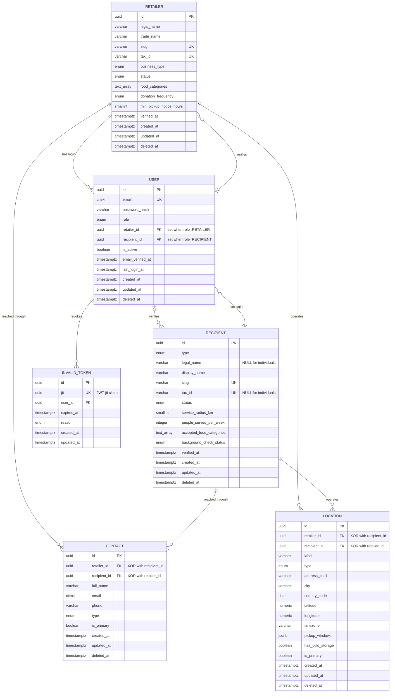

# Spira — Database Schema

Reference for the Spira database. Current scope is the **six tables** that model the two sides of the platform, their shared contact/location data, and authentication.

| Table | Purpose |
|---|---|
| `retailer` | Food-surplus donors — supermarkets, restaurants, hotels, distributors |
| `recipient` | Food receivers — NGOs, foodbanks, soup kitchens, certified individuals |
| `contact` | People to reach at a retailer or recipient |
| `location` | Physical sites belonging to a retailer or recipient |
| `user` | Login credentials, linked to a retailer or recipient |
| `invalid_token` | JWT denylist — tokens revoked before their natural expiry |

> **Status:** draft. Donation lots and matching are not modeled yet.

---

## Conventions

### Naming

Postgres identifiers are **`snake_case`**; TypeORM entity properties are **`camelCase`**. Map them explicitly on each column so the two never drift:

```ts
@CreateDateColumn({ name: 'created_at', type: 'timestamptz' })
createdAt: Date;
```

Tables are **singular** (`retailer`, not `retailers`), matching the reference project's convention.

### Primary keys

Every table uses a **UUID** primary key, never a sequential integer — IDs appear in URLs and API payloads, and sequential IDs leak how many records exist and let anyone enumerate them.

```sql
id uuid PRIMARY KEY DEFAULT gen_random_uuid()
```

`gen_random_uuid()` is built into PostgreSQL 13+, so no extension is required. In TypeORM: `@PrimaryGeneratedColumn('uuid')`.

### Audit columns

**Every** table carries these three, with no exceptions:

| Column | Type | Rule |
|---|---|---|
| `created_at` | `timestamptz NOT NULL DEFAULT now()` | Never updated after insert |
| `updated_at` | `timestamptz NOT NULL DEFAULT now()` | Touched on every write |
| `deleted_at` | `timestamptz NULL` | `NULL` = active. Set = soft-deleted |

TypeORM provides `@CreateDateColumn`, `@UpdateDateColumn` and `@DeleteDateColumn`; the last one makes the repository filter out soft-deleted rows automatically.

Two rules that follow from soft delete:

1. **Every unique index must exclude soft-deleted rows**, or a deleted record permanently blocks its own tax ID or slug from being reused. Use partial indexes — `WHERE deleted_at IS NULL`.
2. **Always `timestamptz`, never `timestamp`.** Pickup windows are coordinated across sites; a naive timestamp eventually costs a missed collection.

### Other type choices

- **`numeric` for weights**, never `float` — kilogram totals get summed for impact reports and float rounding accumulates.
- **`citext` for emails** so uniqueness is case-insensitive (requires `CREATE EXTENSION citext`).
- **Enums as Postgres enum types** where values are stable. Adding a value is easy; removing or reordering is not — use `varchar` + `CHECK` if you expect churn.
- **Phones in E.164** format (`+595981123456`).
- **`country_code` as ISO 3166-1 alpha-2** (`PY`, `ES`, `US`).

---

## ER diagram

Key columns shown; full definitions in the table sections below.



### How `contact` and `location` attach to both parents

`contact` and `location` each carry **two nullable foreign keys** — `retailer_id` and `recipient_id` — with a constraint that **exactly one** is set:

```sql
CONSTRAINT chk_contact_owner CHECK (num_nonnulls(retailer_id, recipient_id) = 1)
```

The alternative — a polymorphic `owner_type` + `owner_id` pair — was rejected because Postgres cannot enforce a foreign key against it. You would be able to insert a contact pointing at a retailer that does not exist, and no `ON DELETE` rule would ever fire. The two-nullable-FK approach keeps real referential integrity at the cost of one `CHECK`.

---

## `retailer`

Food-surplus donors. One row per **legal entity**; physical branches live in `location`.

### Identity & legal

| Column | Type | Null | Notes |
|---|---|---|---|
| `id` | `uuid` | NO | PK, `gen_random_uuid()` |
| `legal_name` | `varchar(200)` | NO | Registered company name |
| `trade_name` | `varchar(200)` | YES | Public brand, often differs from legal name |
| `slug` | `varchar(120)` | NO | Unique, URL-friendly |
| `tax_id` | `varchar(40)` | NO | RUC/NIT/CIF/EIN — primary dedupe key, unique |
| `business_type` | `enum` | NO | `SUPERMARKET`, `HYPERMARKET`, `RESTAURANT`, `HOTEL`, `BAKERY`, `CATERING`, `DISTRIBUTOR`, `MANUFACTURER`, `FARM`, `CORPORATE_CAFETERIA`, `CONVENIENCE_STORE`, `OTHER` |
| `description` | `text` | YES | |
| `website` | `varchar(255)` | YES | |
| `logo_url` | `varchar(255)` | YES | |

### Donation policy

Company-level defaults. Site-specific facts (windows, cold storage) live on `location`.

| Column | Type | Null | Notes |
|---|---|---|---|
| `food_categories` | `text[]` | YES | Typically donated: `PRODUCE`, `BAKERY`, `DAIRY`, `MEAT`, `PREPARED`, `DRY_GOODS`, `FROZEN` |
| `donation_frequency` | `enum` | YES | `DAILY`, `WEEKLY`, `BIWEEKLY`, `AD_HOC` |
| `requires_recipient_transport` | `boolean` | NO | Default `true` — recipient collects |
| `min_pickup_notice_hours` | `smallint` | YES | Lead time before collection |
| `handling_instructions` | `text` | YES | Loading dock, ask for the manager, etc. |

### Verification & compliance

| Column | Type | Null | Notes |
|---|---|---|---|
| `status` | `enum` | NO | `PENDING_VERIFICATION`, `ACTIVE`, `SUSPENDED`, `INACTIVE` |
| `verified_at` | `timestamptz` | YES | |
| `verified_by` | `uuid` | YES | **FK → `user(id)` ON DELETE SET NULL** — the admin who approved it |
| `food_safety_license_number` | `varchar(80)` | YES | |
| `food_safety_license_expires_at` | `date` | YES | Worth alerting on before expiry |
| `terms_accepted_at` | `timestamptz` | YES | Liability matters in food donation |
| `terms_version` | `varchar(20)` | YES | Which version they accepted |

### Audit

`created_at`, `updated_at`, `deleted_at` — see [Conventions](#audit-columns).

---

## `recipient`

Food receivers. Covers organizations **and** certified individuals, which is why several identity columns are nullable.

### Identity

| Column | Type | Null | Notes |
|---|---|---|---|
| `id` | `uuid` | NO | PK |
| `type` | `enum` | NO | `NGO`, `FOOD_BANK`, `SOUP_KITCHEN`, `SHELTER`, `COMMUNITY_FRIDGE`, `CHURCH`, `SCHOOL`, `CERTIFIED_INDIVIDUAL` |
| `legal_name` | `varchar(200)` | **YES** | Null for `CERTIFIED_INDIVIDUAL` |
| `display_name` | `varchar(200)` | NO | Always present — org name or person's name |
| `slug` | `varchar(120)` | NO | Unique |
| `tax_id` | `varchar(40)` | **YES** | Organizations only, unique when present |
| `nonprofit_registration_number` | `varchar(80)` | YES | Proof of nonprofit status |
| `national_id` | `varchar(40)` | YES | Individuals only — **encrypt at rest**, personal data |
| `mission` | `text` | YES | |
| `website` | `varchar(255)` | YES | |
| `logo_url` | `varchar(255)` | YES | |

### Transport capability

Organization-level — the recipient owns the vehicle, not the site.

| Column | Type | Null | Notes |
|---|---|---|---|
| `service_radius_km` | `smallint` | YES | How far they will travel — **primary geo filter when matching** |
| `has_vehicle` | `boolean` | NO | Default `false` |
| `transport_capacity_kg` | `numeric(8,2)` | YES | Caps the lot size offered to them |
| `has_refrigerated_transport` | `boolean` | NO | Default `false` — gates chilled/frozen matches |

### Capacity & acceptance rules

| Column | Type | Null | Notes |
|---|---|---|---|
| `people_served_per_week` | `integer` | YES | Drives fair allocation between recipients |
| `max_daily_intake_kg` | `numeric(8,2)` | YES | Prevents offering more than they can handle |
| `accepted_food_categories` | `text[]` | YES | Intersect with retailer's `food_categories` |
| `excluded_food_categories` | `text[]` | YES | |
| `dietary_restrictions` | `text[]` | YES | `HALAL`, `KOSHER`, `NO_PORK`, `NO_ALCOHOL`, `VEGETARIAN` |
| `accepts_near_expiry` | `boolean` | NO | Default `false` — major differentiator in food rescue |
| `accepts_prepared_food` | `boolean` | NO | Default `false` — higher liability |
| `accepts_frozen` | `boolean` | NO | Default `false` |

### Verification & compliance

| Column | Type | Null | Notes |
|---|---|---|---|
| `status` | `enum` | NO | Same set as `retailer.status` |
| `verified_at` | `timestamptz` | YES | |
| `verified_by` | `uuid` | YES | **FK → `user(id)` ON DELETE SET NULL** |
| `food_handling_certification_number` | `varchar(80)` | YES | |
| `certification_expires_at` | `date` | YES | |
| `background_check_status` | `enum` | NO | `NOT_REQUIRED`, `PENDING`, `PASSED`, `FAILED` — matters most for `CERTIFIED_INDIVIDUAL` |
| `insurance_policy_number` | `varchar(80)` | YES | Required in some jurisdictions |
| `terms_accepted_at` | `timestamptz` | YES | |
| `terms_version` | `varchar(20)` | YES | |

### Audit

`created_at`, `updated_at`, `deleted_at`.

---

## `contact`

People to reach at a retailer or recipient. Many per owner, so you can hold an operations lead separately from a billing contact.

| Column | Type | Null | Notes |
|---|---|---|---|
| `id` | `uuid` | NO | PK |
| `retailer_id` | `uuid` | YES | **FK → `retailer(id)` ON DELETE CASCADE** |
| `recipient_id` | `uuid` | YES | **FK → `recipient(id)` ON DELETE CASCADE** |
| `full_name` | `varchar(150)` | NO | |
| `email` | `citext` | YES | Case-insensitive |
| `phone` | `varchar(30)` | YES | E.164 |
| `secondary_phone` | `varchar(30)` | YES | |
| `job_title` | `varchar(100)` | YES | |
| `type` | `enum` | NO | `PRIMARY`, `OPERATIONS`, `LOGISTICS`, `BILLING`, `EMERGENCY` |
| `is_primary` | `boolean` | NO | Default `false` — at most one per owner |
| `notes` | `text` | YES | |
| `created_at` / `updated_at` / `deleted_at` | `timestamptz` | | Audit |

### Constraints

```sql
-- Exactly one owner
CONSTRAINT chk_contact_owner CHECK (num_nonnulls(retailer_id, recipient_id) = 1)

-- At most one primary contact per owner, ignoring soft-deleted rows
CREATE UNIQUE INDEX uq_contact_primary_retailer ON contact (retailer_id)
  WHERE is_primary AND retailer_id IS NOT NULL AND deleted_at IS NULL;

CREATE UNIQUE INDEX uq_contact_primary_recipient ON contact (recipient_id)
  WHERE is_primary AND recipient_id IS NOT NULL AND deleted_at IS NULL;
```

---

## `location`

Physical sites. A supermarket chain has many stores; a foodbank may have a warehouse and a distribution point. **Matching happens against this table**, not against the parent — proximity, pickup windows and cold storage are all site-level facts.

| Column | Type | Null | Notes |
|---|---|---|---|
| `id` | `uuid` | NO | PK |
| `retailer_id` | `uuid` | YES | **FK → `retailer(id)` ON DELETE CASCADE** |
| `recipient_id` | `uuid` | YES | **FK → `recipient(id)` ON DELETE CASCADE** |
| `label` | `varchar(150)` | NO | Human name — "Sucursal Centro", "Main warehouse" |
| `type` | `enum` | NO | `STORE`, `WAREHOUSE`, `DISTRIBUTION_CENTER`, `KITCHEN`, `OFFICE`, `PICKUP_POINT` |
| `address_line1` | `varchar(200)` | NO | |
| `address_line2` | `varchar(200)` | YES | |
| `city` | `varchar(100)` | NO | |
| `state` | `varchar(100)` | YES | |
| `postal_code` | `varchar(20)` | YES | |
| `country_code` | `char(2)` | NO | ISO 3166-1 alpha-2 |
| `latitude` | `numeric(9,6)` | YES | |
| `longitude` | `numeric(10,6)` | YES | |
| `timezone` | `varchar(50)` | NO | IANA — `America/Asuncion` |
| `pickup_windows` | `jsonb` | YES | Recurring availability by weekday |
| `has_cold_storage` | `boolean` | NO | Default `false` |
| `has_freezer` | `boolean` | NO | Default `false` |
| `storage_capacity_kg` | `numeric(8,2)` | YES | |
| `phone` | `varchar(30)` | YES | Site line, may differ from any contact |
| `is_primary` | `boolean` | NO | Default `false` — the headquarters/main site |
| `is_active` | `boolean` | NO | Default `true` — temporarily not accepting collections |
| `created_at` / `updated_at` / `deleted_at` | `timestamptz` | | Audit |

### Constraints

```sql
CONSTRAINT chk_location_owner CHECK (num_nonnulls(retailer_id, recipient_id) = 1)

CREATE UNIQUE INDEX uq_location_primary_retailer ON location (retailer_id)
  WHERE is_primary AND retailer_id IS NOT NULL AND deleted_at IS NULL;

CREATE UNIQUE INDEX uq_location_primary_recipient ON location (recipient_id)
  WHERE is_primary AND recipient_id IS NOT NULL AND deleted_at IS NULL;
```

### On geo

`latitude`/`longitude` as `numeric` is fine to start. Once you need *"recipients within 15 km of this store"*, switch to **PostGIS** (`location geography(Point,4326)` + a GIST index) — it is cheap to adopt now and disruptive to retrofit after the matching code is written.

---

## `user`

Login credentials, nothing more. **Identity only, no profile data** — names and phone numbers live in [`contact`](#contact). This table exists so somebody can authenticate.

| Column | Type | Null | Notes |
|---|---|---|---|
| `id` | `uuid` | NO | PK |
| `email` | `citext` | NO | Login identifier, unique |
| `password_hash` | `varchar(255)` | NO | bcrypt/argon2 output. Never store or log plaintext |
| `role` | `enum` | NO | `ADMIN`, `RETAILER`, `RECIPIENT` |
| `retailer_id` | `uuid` | YES | **FK → `retailer(id)` ON DELETE CASCADE** |
| `recipient_id` | `uuid` | YES | **FK → `recipient(id)` ON DELETE CASCADE** |
| `is_active` | `boolean` | NO | Default `true`. `false` blocks login without deleting the account |
| `email_verified_at` | `timestamptz` | YES | `NULL` = unverified |
| `last_login_at` | `timestamptz` | YES | |
| `created_at` / `updated_at` / `deleted_at` | `timestamptz` | | Audit |

### Constraints

The profile link is driven by `role`: an admin belongs to neither side, everyone else to exactly one.

```sql
CONSTRAINT chk_user_role_profile CHECK (
     (role = 'RETAILER'  AND retailer_id  IS NOT NULL AND recipient_id IS NULL)
  OR (role = 'RECIPIENT' AND recipient_id IS NOT NULL AND retailer_id  IS NULL)
  OR (role = 'ADMIN'     AND retailer_id  IS NULL     AND recipient_id IS NULL)
);

CREATE UNIQUE INDEX uq_user_email ON "user" (email) WHERE deleted_at IS NULL;
```

> ⚠️ **`user` is a reserved word in PostgreSQL** and must be quoted as `"user"` in raw SQL. TypeORM quotes identifiers automatically so `@Entity('user')` works, but every hand-written migration and raw query needs the quotes. Naming the table **`app_user`** avoids the footgun entirely — worth deciding before the first migration.

### Deliberately omitted

`full_name` and `phone` (they belong in `contact`), MFA fields, `failed_login_attempts` / lockout, and password-reset tokens. Add them when the feature arrives rather than carrying dead columns.

---

## `invalid_token`

JWT denylist. A JWT stays cryptographically valid until it expires, so logging out server-side means recording that a specific token must no longer be accepted.

Stores the token's **`jti`** claim — a UUID you attach to each JWT at sign time — rather than the token string itself. The `jti` is enough to identify the token, and unlike the raw JWT it is not a usable credential if this table ever leaks.

| Column | Type | Null | Notes |
|---|---|---|---|
| `id` | `uuid` | NO | PK |
| `jti` | `uuid` | NO | The JWT `jti` claim. Unique |
| `user_id` | `uuid` | NO | **FK → `user(id)` ON DELETE CASCADE** |
| `expires_at` | `timestamptz` | NO | Copied from the token's `exp`. Rows are purgeable after this |
| `reason` | `enum` | NO | `LOGOUT`, `PASSWORD_CHANGE`, `ADMIN_REVOKE`, `SECURITY` |
| `created_at` | `timestamptz` | NO | When the token was invalidated |
| `updated_at` | `timestamptz` | NO | Rows are never updated; kept for consistency |

### No `deleted_at` here — deliberate

This is the one table that breaks the soft-delete rule, for a security reason.

TypeORM's `@DeleteDateColumn` makes the repository **silently filter out soft-deleted rows**. If a denylist entry were soft-deleted, the lookup would stop finding it and the revoked token would start being accepted again — the failure mode is *fail-open*, and it would be invisible.

Expired entries are removed by a purge job instead:

```sql
DELETE FROM invalid_token WHERE expires_at < now();
```

That is safe because once a token is past its `exp`, normal JWT validation rejects it anyway — the row is dead weight, not a security control.

### Auth-path query

Every authenticated request hits this table, so the `jti` index is not optional:

```sql
CREATE UNIQUE INDEX uq_invalid_token_jti ON invalid_token (jti);
CREATE INDEX idx_invalid_token_expires   ON invalid_token (expires_at);
```

> A denylist means every request does a DB read. That is fine at current scale; if it becomes hot, the usual fix is to mirror the denylist in Redis with a TTL equal to the token's remaining lifetime, keeping this table as the source of truth.

---

## Foreign keys

| Child | Column | Parent | On delete |
|---|---|---|---|
| `contact` | `retailer_id` | `retailer(id)` | `CASCADE` |
| `contact` | `recipient_id` | `recipient(id)` | `CASCADE` |
| `location` | `retailer_id` | `retailer(id)` | `CASCADE` |
| `location` | `recipient_id` | `recipient(id)` | `CASCADE` |
| `user` | `retailer_id` | `retailer(id)` | `CASCADE` |
| `user` | `recipient_id` | `recipient(id)` | `CASCADE` |
| `invalid_token` | `user_id` | `user(id)` | `CASCADE` |
| `retailer` | `verified_by` | `user(id)` | `SET NULL` |
| `recipient` | `verified_by` | `user(id)` | `SET NULL` |

`verified_by` uses `SET NULL` rather than `CASCADE` — deleting the admin who approved a retailer must never delete the retailer. The rest use `CASCADE` because both parents are **soft**-deleted in normal operation — a hard delete only happens for a genuine purge (GDPR erasure, test data), and in that case the contacts and locations should go with it.

---

## Indexes

Beyond the primary keys and the partial unique indexes listed above:

```sql
-- Uniqueness, excluding soft-deleted rows
CREATE UNIQUE INDEX uq_retailer_slug   ON retailer (slug)   WHERE deleted_at IS NULL;
CREATE UNIQUE INDEX uq_retailer_tax_id ON retailer (tax_id) WHERE deleted_at IS NULL;
CREATE UNIQUE INDEX uq_recipient_slug  ON recipient (slug)  WHERE deleted_at IS NULL;
CREATE UNIQUE INDEX uq_recipient_tax_id ON recipient (tax_id)
  WHERE deleted_at IS NULL AND tax_id IS NOT NULL;

-- Foreign key columns (Postgres does not index these automatically)
CREATE INDEX idx_contact_retailer   ON contact (retailer_id);
CREATE INDEX idx_contact_recipient  ON contact (recipient_id);
CREATE INDEX idx_location_retailer  ON location (retailer_id);
CREATE INDEX idx_location_recipient ON location (recipient_id);

-- Common filters
CREATE INDEX idx_retailer_status  ON retailer (status)  WHERE deleted_at IS NULL;
CREATE INDEX idx_recipient_status ON recipient (status) WHERE deleted_at IS NULL;
CREATE INDEX idx_location_geo     ON location (latitude, longitude);

-- Array containment for category matching
CREATE INDEX idx_retailer_categories  ON retailer  USING GIN (food_categories);
CREATE INDEX idx_recipient_categories ON recipient USING GIN (accepted_food_categories);

-- Auth
CREATE UNIQUE INDEX uq_user_email        ON "user" (email) WHERE deleted_at IS NULL;
CREATE INDEX idx_user_retailer           ON "user" (retailer_id);
CREATE INDEX idx_user_recipient          ON "user" (recipient_id);
CREATE UNIQUE INDEX uq_invalid_token_jti ON invalid_token (jti);
CREATE INDEX idx_invalid_token_user      ON invalid_token (user_id);
CREATE INDEX idx_invalid_token_expires   ON invalid_token (expires_at);
```

Postgres creates an index for a `PRIMARY KEY` and `UNIQUE` constraint, but **not** for a foreign key column — without the four above, deleting a retailer scans every contact and location row.

---

## Not modeled yet

Deliberately out of scope for this pass:

| Concern | Why deferred |
|---|---|
| Refresh tokens | Access-token revocation works without them; add a `refresh_token` table when you introduce token rotation |
| Donation lots | The core transaction — needs its own design pass |
| Matching | Depends on lots existing |
| Documents / attachments | Verification files want their own table |
| Impact metrics | Derive from donation records; denormalized counters on the profile go stale |
